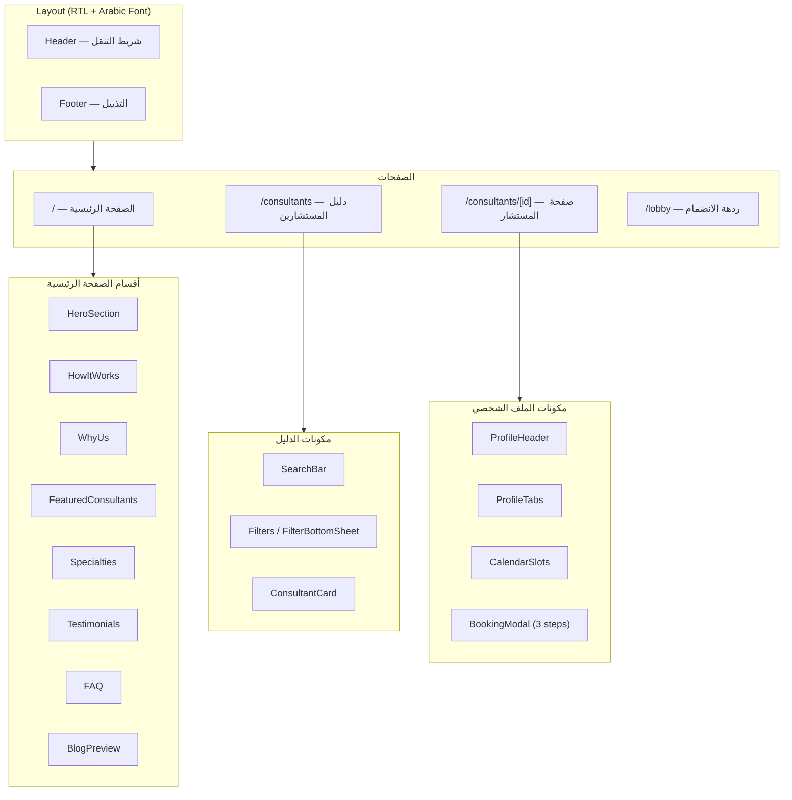
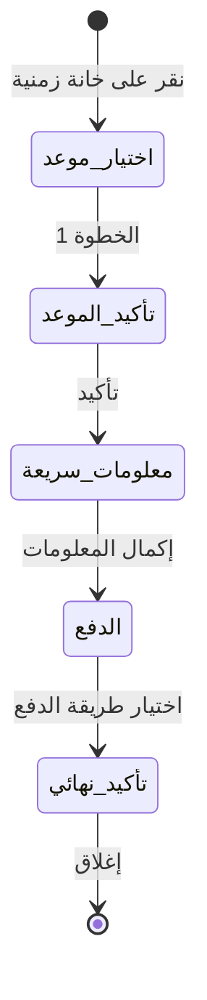

# وثيقة التصميم — صفحات عرض BRD لمنصة الاستشارات النفسية

## نظرة عامة (Overview)

هذا التصميم يغطي بناء 4 صفحات عرض ثابتة (Static) لمنصة استشارات نفسية إلكترونية تستهدف السوق السعودي. الصفحات مخصصة لالتقاط لقطات شاشة (Screenshots) لوثيقة متطلبات الأعمال (BRD). لا يوجد خادم خلفي أو قاعدة بيانات — جميع البيانات وهمية مكتوبة في ملفات TypeScript.

الصفحات المطلوبة:

1. **الصفحة الرئيسية (Landing Page)** — `/` — صفحة هبوط تسويقية
2. **دليل المستشارين (Consultant Directory)** — `/consultants` — قائمة المستشارين مع بحث وفلاتر
3. **صفحة المستشار (Consultant Profile)** — `/consultants/[id]` — ملف شخصي تفصيلي مع تدفق حجز
4. **ردهة الانضمام (Pre-Join Lobby)** — `/lobby` — فحص الكاميرا والميكروفون (اختياري)

### قرارات التصميم الرئيسية

- **خط عربي**: IBM Plex Sans Arabic من Google Fonts — يدعم جميع الأوزان ومتوفر مجاناً
- **RTL**: تطبيق `dir="rtl"` و `lang="ar"` على عنصر `<html>` في `layout.tsx` الجذري
- **الألوان**: تعريف ألوان المنصة (Teal/Indigo/Amber) في `globals.css` ضمن `@theme`
- **البيانات**: ملفات TypeScript ثابتة في `src/data/` مع أنواع (Types) محددة
- **المكونات المشتركة**: Header و Footer مشتركان بين جميع الصفحات
- **الحركات**: استخدام Tailwind CSS transitions و animations البسيطة (hover, scroll)
- **لا اختبارات**: هذا مشروع عرض توضيحي فقط — لا حاجة لاختبارات

## الهندسة المعمارية (Architecture)

### هيكل الملفات

```
src/
├── app/
│   ├── layout.tsx                          # تعديل: RTL + خط عربي + ألوان
│   ├── page.tsx                            # تعديل: Landing Page
│   ├── consultants/
│   │   ├── page.tsx                        # جديد: Consultant Directory
│   │   └── [id]/
│   │       └── page.tsx                    # جديد: Consultant Profile
│   └── lobby/
│       └── page.tsx                        # جديد: Pre-Join Lobby
├── components/
│   ├── layout/
│   │   ├── Header.tsx                      # شريط التنقل العلوي
│   │   └── Footer.tsx                      # التذييل
│   ├── landing/
│   │   ├── HeroSection.tsx                 # قسم البطل
│   │   ├── HowItWorks.tsx                  # كيف تعمل المنصة
│   │   ├── WhyUs.tsx                       # لماذا نحن
│   │   ├── FeaturedConsultants.tsx          # المستشارين المميزين
│   │   ├── Specialties.tsx                 # التخصصات
│   │   ├── Testimonials.tsx                # آراء العملاء
│   │   ├── FAQ.tsx                         # الأسئلة الشائعة
│   │   └── BlogPreview.tsx                 # معاينة المدونة
│   ├── consultants/
│   │   ├── ConsultantCard.tsx              # بطاقة مستشار (مشتركة)
│   │   ├── SearchBar.tsx                   # شريط البحث
│   │   ├── Filters.tsx                     # فلاتر التصفية
│   │   └── FilterBottomSheet.tsx           # فلاتر الهاتف (Bottom Sheet)
│   ├── profile/
│   │   ├── ProfileHeader.tsx               # رأس الملف الشخصي
│   │   ├── ProfileTabs.tsx                 # تبويبات المحتوى
│   │   ├── CalendarSlots.tsx               # تقويم المواعيد
│   │   └── BookingModal.tsx                # نافذة الحجز (3 خطوات)
│   └── ui/
│       ├── TrustBadges.tsx                 # شارات الثقة
│       └── Card.tsx                        # بطاقة عامة
├── data/
│   ├── consultants.ts                      # بيانات المستشارين الوهمية
│   ├── landing.ts                          # محتوى الصفحة الرئيسية
│   └── types.ts                            # أنواع TypeScript
└── styles/
    └── globals.css                         # تعديل: ألوان المنصة + خط عربي
```

### مخطط المكونات



## المكونات والواجهات (Components and Interfaces)

### المكونات المشتركة

#### Header (`src/components/layout/Header.tsx`)

- شعار المنصة (نص + أيقونة) على اليمين (RTL)
- روابط التنقل: الرئيسية، المستشارين، المدونة، تواصل معنا
- زر "تسجيل الدخول" على اليسار (RTL)
- قائمة هامبرغر على الهاتف
- خلفية شفافة مع blur عند التمرير

#### Footer (`src/components/layout/Footer.tsx`)

- 3 أعمدة: روابط سريعة، التخصصات، تواصل معنا
- شارات الثقة (TrustBadges)
- حقوق النشر

#### ConsultantCard (`src/components/consultants/ConsultantCard.tsx`)

- مستخدم في الصفحة الرئيسية (FeaturedConsultants) وصفحة الدليل
- يعرض: صورة، اسم، تخصص، تقييم (نجوم)، سعر، أقرب موعد
- رابط إلى صفحة المستشار
- Props: `consultant: Consultant`

#### Card (`src/components/ui/Card.tsx`)

- بطاقة عامة بزوايا مستديرة (rounded-2xl) وظل ناعم
- Props: `children`, `className?`

#### TrustBadges (`src/components/ui/TrustBadges.tsx`)

- شارات: الدفع الآمن، التأكيد الفوري، جلسات فيديو، تشفير TLS، جاهزية ZATCA
- أيقونات من lucide-react

### مكونات الصفحة الرئيسية

| المكون              | الوصف                               | البيانات               |
| ------------------- | ----------------------------------- | ---------------------- |
| HeroSection         | عنوان + وصف + CTA + صورة/تدرج خلفية | `landing.hero`         |
| HowItWorks          | 3 خطوات مرقمة بأيقونات              | `landing.steps`        |
| WhyUs               | بطاقات مزايا (4-6 بطاقات)           | `landing.features`     |
| FeaturedConsultants | بطاقات مستشارين (3-4)               | `consultants` (أول 4)  |
| Specialties         | شرائح Chips قابلة للنقر             | `landing.specialties`  |
| Testimonials        | اقتباسات عملاء بأسماء مستعارة       | `landing.testimonials` |
| FAQ                 | أكورديون أسئلة وأجوبة               | `landing.faq`          |
| BlogPreview         | بطاقات مقالات (3)                   | `landing.blogPosts`    |

### مكونات دليل المستشارين

| المكون            | الوصف                                    |
| ----------------- | ---------------------------------------- |
| SearchBar         | حقل بحث نصي مع أيقونة بحث                |
| Filters           | فلاتر جانبية: تخصص، جنس، لغة، سعر، تقييم |
| FilterBottomSheet | نفس الفلاتر كورقة سفلية على الهاتف       |

### مكونات صفحة المستشار

| المكون        | الوصف                                                 |
| ------------- | ----------------------------------------------------- |
| ProfileHeader | صورة + اسم + تخصص + تقييم + جلسات + سعر               |
| ProfileTabs   | تبويبات: نبذة، خبرات، تخصصات، تقييمات، سياسات         |
| CalendarSlots | تقويم أسبوعي مع خانات زمنية                           |
| BookingModal  | Modal من 3 خطوات: تأكيد ← معلومات ← دفع ← تأكيد نهائي |

### تدفق الحجز (BookingModal)



## نماذج البيانات (Data Models)

### الأنواع (`src/data/types.ts`)

```typescript
// مستشار
export interface Consultant {
  id: string;
  name: string;
  title: string; // مثل: "أخصائي نفسي إكلينيكي"
  specialties: string[];
  rating: number; // 1-5
  reviewCount: number;
  sessionsCompleted: number;
  pricePerSession: number; // بالريال السعودي
  currency: string; // "SAR"
  gender: 'male' | 'female';
  languages: string[];
  imageUrl: string;
  bio: string;
  experience: string[];
  availableSlots: TimeSlot[];
  reviews: Review[];
  cancellationPolicy: string;
}

// خانة زمنية
export interface TimeSlot {
  date: string; // "2025-02-15"
  time: string; // "14:00"
  available: boolean;
}

// تقييم
export interface Review {
  id: string;
  alias: string; // اسم مستعار
  rating: number;
  comment: string;
  date: string;
}

// محتوى الصفحة الرئيسية
export interface LandingContent {
  hero: {
    title: string;
    subtitle: string;
    ctaText: string;
  };
  steps: { icon: string; title: string; description: string }[];
  features: { icon: string; title: string; description: string }[];
  specialties: string[];
  testimonials: { alias: string; rating: number; quote: string }[];
  faq: { question: string; answer: string }[];
  blogPosts: {
    title: string;
    excerpt: string;
    imageUrl: string;
    date: string;
  }[];
}

// طرق الدفع
export type PaymentMethod =
  | 'mada'
  | 'visa'
  | 'mastercard'
  | 'apple_pay'
  | 'stc_pay';
```

### ملف بيانات المستشارين (`src/data/consultants.ts`)

يحتوي على مصفوفة من 6-8 مستشارين وهميين بأسماء عربية، تخصصات متنوعة (قلق، اكتئاب، علاقات، أطفال، إدمان، صدمات)، تقييمات بين 4.2 و 4.9، وأسعار بين 200-450 ريال.

### ملف محتوى الصفحة الرئيسية (`src/data/landing.ts`)

يحتوي على جميع النصوص التسويقية باللغة العربية بنبرة داعمة ومطمئنة، بما في ذلك:

- عنوان البطل والوصف
- خطوات "كيف تعمل المنصة" (اختر مستشارك ← احجز موعدك ← ابدأ جلستك)
- مزايا المنصة (خصوصية تامة، مستشارون معتمدون، مرونة المواعيد، إلخ)
- قائمة التخصصات
- آراء العملاء بأسماء مستعارة
- أسئلة شائعة (5-7 أسئلة)
- مقالات مدونة وهمية (3 مقالات)

## إعداد الألوان والخط في Tailwind CSS 4

### تعديل `src/styles/globals.css`

إضافة ألوان المنصة وخط IBM Plex Sans Arabic ضمن `@theme`:

```css
@theme {
  /* الخط العربي */
  --font-primary: 'IBM Plex Sans Arabic', system-ui, sans-serif;

  /* ألوان المنصة */
  --color-teal: #0ea5a4;
  --color-teal-light: #14b8a6;
  --color-teal-dark: #0d9488;
  --color-indigo: #6366f1;
  --color-indigo-light: #818cf8;
  --color-indigo-dark: #4f46e5;
  --color-amber: #f59e0b;
  --color-amber-light: #fbbf24;
  --color-bg: #f8fafc;
  --color-text: #0b1220;
  --color-text-muted: #64748b;
  --color-border: #e2e8f0;
}
```

### تعديل `src/app/layout.tsx`

```tsx
import { IBM_Plex_Sans_Arabic } from 'next/font/google';

const ibmPlexArabic = IBM_Plex_Sans_Arabic({
  subsets: ['arabic'],
  weight: ['300', '400', '500', '600', '700'],
  variable: '--font-primary',
});

export default function RootLayout({
  children,
}: {
  children: React.ReactNode;
}) {
  return (
    <html lang='ar' dir='rtl' className={ibmPlexArabic.variable}>
      <body className='bg-bg text-text font-primary'>{children}</body>
    </html>
  );
}
```

### أنماط التصميم المشتركة

- **بطاقات**: `rounded-2xl shadow-sm border border-border bg-white`
- **تدرج لوني**: `bg-gradient-to-l from-teal to-indigo` (اتجاه RTL)
- **أزرار أساسية**: `bg-teal text-white rounded-xl px-6 py-3 hover:bg-teal-dark transition`
- **أزرار ثانوية**: `border border-teal text-teal rounded-xl px-6 py-3 hover:bg-teal/10 transition`
- **Hover effects**: `transition-all duration-200 hover:shadow-md hover:-translate-y-0.5`

## خصائص الصحة (Correctness Properties)

_الخاصية (Property) هي سلوك أو صفة يجب أن تكون صحيحة عبر جميع عمليات التنفيذ الصالحة للنظام — بمعنى آخر، هي تصريح رسمي حول ما يجب أن يفعله النظام. تعمل الخصائص كجسر بين المواصفات المقروءة بشرياً وضمانات الصحة القابلة للتحقق آلياً._

بما أن هذا المشروع عبارة عن صفحات عرض ثابتة (Static) لالتقاط لقطات شاشة فقط، فإن معظم معايير القبول تتعلق بوجود عناصر UI محددة أو تكوينات بصرية — وهي أمثلة (examples) وليست خصائص عامة (properties). ومع ذلك، هناك بعض الخصائص القابلة للاختبار كخصائص عامة:

### Property 1: بطاقة المستشار تعرض جميع الحقول المطلوبة

_For any_ مستشار من البيانات الوهمية، عند عرض بطاقته (ConsultantCard)، يجب أن يحتوي الناتج المعروض على: الصورة، الاسم، التخصص، التقييم، السعر، وأقرب موعد متاح.

**Validates: Requirements 4.4, 5.3**

### Property 2: رابط بطاقة المستشار يشير إلى الصفحة الصحيحة

_For any_ مستشار من البيانات الوهمية، يجب أن يحتوي رابط بطاقته على المسار `/consultants/{id}` حيث `{id}` هو معرّف ذلك المستشار.

**Validates: Requirements 5.5**

### Property 3: رأس الملف الشخصي يعرض جميع الحقول المطلوبة

_For any_ مستشار من البيانات الوهمية، عند عرض رأس ملفه الشخصي (ProfileHeader)، يجب أن يحتوي الناتج المعروض على: الصورة، الاسم، التخصص، التقييم، عدد الجلسات المكتملة، والسعر.

**Validates: Requirements 6.1**

## معالجة الأخطاء (Error Handling)

بما أن هذا مشروع عرض ثابت بدون خادم خلفي أو استدعاءات API، فإن معالجة الأخطاء محدودة:

| السيناريو                                              | المعالجة                                                             |
| ------------------------------------------------------ | -------------------------------------------------------------------- |
| مستشار غير موجود (`/consultants/[id]` بمعرّف غير صالح) | عرض صفحة `not-found.tsx` الموجودة مسبقاً عبر `notFound()` من Next.js |
| صفحة غير موجودة                                        | صفحة `not-found.tsx` الموجودة مسبقاً                                 |
| خطأ في العرض (Runtime Error)                           | صفحة `error.tsx` الموجودة مسبقاً                                     |
| صورة مستشار غير متوفرة                                 | استخدام صورة placeholder افتراضية عبر `NextImage` مع `fallback`      |

لا حاجة لمعالجة أخطاء الشبكة أو API أو المصادقة — جميع البيانات ثابتة ومحلية.

## استراتيجية الاختبار (Testing Strategy)

### النهج العام

المستخدم صرّح بوضوح أن هذا مشروع عرض توضيحي لالتقاط لقطات شاشة فقط — **لا حاجة لاختبارات**. ومع ذلك، نوثق هنا كيف يمكن اختبار الخصائص المحددة أعلاه إذا دعت الحاجة مستقبلاً.

### اختبارات الوحدة (Unit Tests) — اختياري

إذا أُريد إضافة اختبارات لاحقاً، يمكن استخدام Jest + React Testing Library (الموجودين مسبقاً في المشروع):

- التحقق من وجود أقسام الصفحة الرئيسية (Hero, HowItWorks, FAQ, إلخ)
- التحقق من وجود عناصر Header و Footer
- التحقق من أن تدفق الحجز ينتقل بين الخطوات الثلاث
- التحقق من وجود 5 شارات ثقة محددة
- التحقق من وجود 5 فلاتر تصفية محددة

### اختبارات الخصائص (Property-Based Tests) — اختياري

إذا أُريد إضافة اختبارات خصائص لاحقاً، يمكن استخدام مكتبة `fast-check` مع Jest:

- كل اختبار خاصية يجب أن يعمل بحد أدنى 100 تكرار
- كل اختبار يُعلّم بتعليق يشير إلى الخاصية في وثيقة التصميم
- صيغة التعليق: **Feature: mental-health-platform-brd-pages, Property {number}: {property_text}**

| الخاصية    | نوع الاختبار  | الوصف                                                                        |
| ---------- | ------------- | ---------------------------------------------------------------------------- |
| Property 1 | Property Test | توليد بيانات مستشارين عشوائية والتحقق من أن ConsultantCard يعرض جميع الحقول  |
| Property 2 | Property Test | توليد مستشارين بمعرّفات عشوائية والتحقق من أن الرابط يحتوي على المسار الصحيح |
| Property 3 | Property Test | توليد بيانات مستشارين عشوائية والتحقق من أن ProfileHeader يعرض جميع الحقول   |

### ملاحظة مهمة

بناءً على طلب المستخدم الصريح، **لن يتم تنفيذ أي اختبارات** في هذا المشروع. الخصائص والاستراتيجية موثقة هنا فقط للمرجعية إذا تغيرت المتطلبات مستقبلاً.
